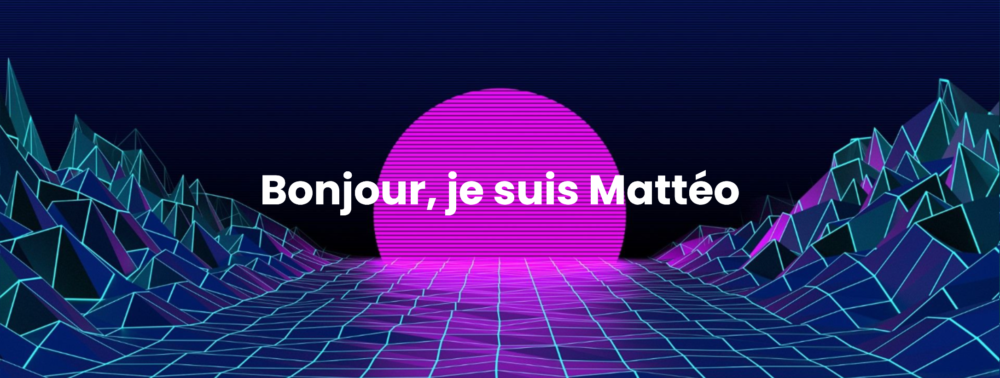

---
## Etudiant en informatique
J'étudie actuellement à l'IUT d'Orléans, je suis en 3ème année de BUT informatique
Je recherche un stage de 4 mois de février à mai 2026 

## Compétences techniques

| Catégorie | Technologie |
| :--- | :--- |
| **BDD** ||
| **Langages** | |
| **Frameworks** |  |
| **Outils** |  |
| **OS** |  |

## Projets

| SAE | SAE |
| :--- | :--- |
|   projet   |   projet   |  
